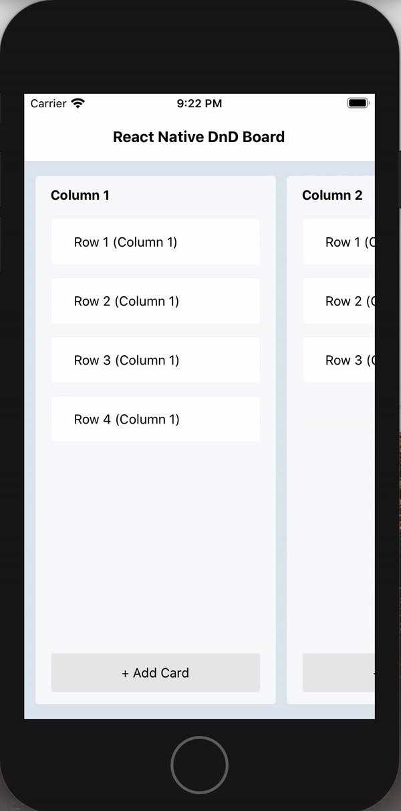
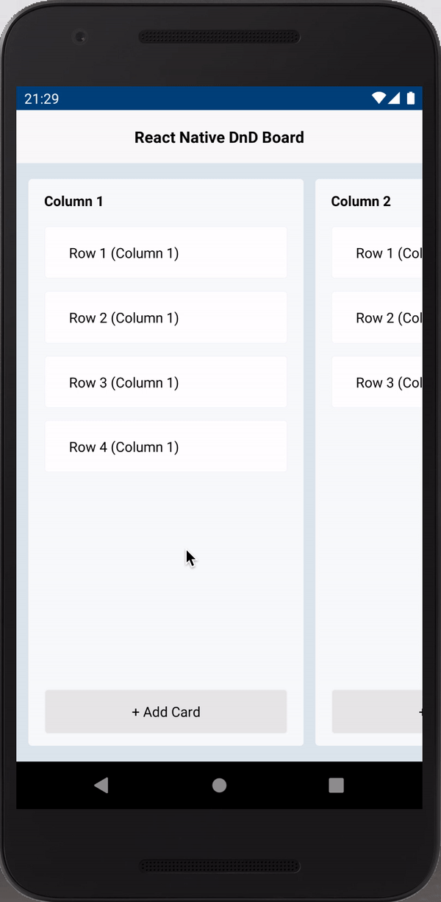

# React Native DnD Board

A drag and drop Kanban board for React Native using [Reanimated (V1)](https://github.com/software-mansion/react-native-reanimated) and [React Native Gesture Handler](https://github.com/software-mansion/react-native-gesture-handler).

   

## Installation

### Step 1:

Install [Reanimated V1](https://docs.swmansion.com/react-native-reanimated/docs/1.x.x/getting_started).

### Step 2:

Install [React Native Gesture Handler](https://docs.swmansion.com/react-native-gesture-handler/docs/).

Make sure your `MainActivity.java` was updated by [follow all Android instructions](https://docs.swmansion.com/react-native-gesture-handler/docs/#android).

**React Native Gesture Handler IMPORTANT NOTE:** If you're using [wix/react-native-navigation](https://github.com/wix/react-native-navigation),
please wrap your board screen using `gestureHandlerRootHOC` ([View RNGH docs for more details](https://docs.swmansion.com/react-native-gesture-handler/docs/#with-wixreact-native-navigation)).
If not do it, your board won't work.

### Step 3:

Install this package using `npm` or `yarn`

with `npm`:

```
npm install react-native-dnd-board
```

with `yarn`:

```
yarn add react-native-dnd-board
```

## API reference

The package exports a `Board` component which is the one you'd use to render the dnd board and a `Repository` class to handle column, row layout.

### `Board`

| Property            | Type                                                    | Required | Description                                                             |
| :------------------ | :------------------------------------------------------ | :------: | :---------------------------------------------------------------------- |
| repository          | `Repository`                                            |   yes    | Object that holds data                                                  |
| renderRow           | `({ item, index }) => {}`                               |   yes    | Function responsible for rendering row item                             |
| renderColumnWrapper | `({ item, index, columnComponent, layoutProps }) => {}` |   yes    | Function responsible for rendering wrapper of the column                |
| onRowPress          | `(row) => {}`                                           |    no    | Function invoked when row pressed                                       |
| onDragStart         | `() => {}`                                              |    no    | Function invoked when drag is started                                   |
| onDragEnd           | `(fromColumnId, toColumnId, row) => {}`                 |    no    | Function invoked when drag is finished                                  |
| style               | `StyleProp`                                             |    no    | Style of the board                                                      |
| columnWidth         | `number`                                                |    no    | Initial min column width                                                |
| accessoryRight      | `function\|View`                                        |    no    | Render end of the board. Useful when rendering virtual add more column. |
| activeRowStyle      | `StyleProp`                                             |    no    | A custom style for the row when being dragged.                          |
| activeRowRotation   | `number`                                                |    no    | Degrees to rotate the row when being dragged. Default is 8.             |
| xScrollThreshold    | `number`                                                |    no    | Offset from X to calculate scroll from. Default is 50.                  |
| yScrollThreshold    | `number`                                                |    no    | Offset from Y for the rows. Default is 50.                              |
| dragSpeedFactor     | `number`                                                |    no    | When dragging you can accelerate the scrollTo position. Default is 1.   |

### `Repository`

#### Update repository data:
```js
repository.updateData(data);
```
#### Handle column data:
```js
repository.addColumn(data);
```
```js
repository.updateColumn(columnId, data);
```
```js
repository.deleteColumn(columnId);
```
#### Handle row data:
```js
repository.addRow(columnId, data);
```
```js
repository.updateRow(rowId, data);
```
```js
repository.deleteRow(rowId);
```

#### Get rows with index updated:
```js
const { rows } = repository.getItemsChanged();
```
**[Example](https://github.com/hungga1711/react-native-dnd-board/blob/master/example/App.js)**
## Usage

You need to build `Repository`

```js
import Board, { Repository } from "react-native-dnd-board";

const mockData = [
  {
    id: "1",
    name: "Column 1",
    rows: [
      {
        id: "11",
        name: "Row 1 (Column 1)",
      },
      {
        id: "12",
        name: "Row 2 (Column 1)",
      },
    ],
  },
  {
    id: "2",
    name: "Column 2",
    rows: [
      {
        id: "21",
        name: "Row 1 (Column 2)",
      },
    ],
  },
];

const [repository, setRepository] = useState(new Repository(mockData));
```

Render the `Board`

```js
<Board
  repository={repository}
  renderRow={renderCard}
  renderColumnWrapper={renderColumnWrapper}
  onRowPress={onCardPress}
  onDragEnd={onDragEnd}
/>
```

`renderColumnWrapper` function

```js
const renderColumnWrapper = ({ item, columnComponent, layoutProps }) => {
  return (
    <View style={styles.column} {...layoutProps}>
      <Text style={styles.columnName}>{item.name}</Text>
      {columnComponent}
    </View>
  );
};
```

**IMPORTANT:** You need pass `layoutProps` to wrapper view props and `columnComponent` must be rendered inside `renderColumnWrapper` fuction.

See [example](https://github.com/hungga1711/react-native-dnd-board/blob/master/example/App.js) for more details.

## Performance

We're trying to improve board performance. If you have a better solution, please open a [issue](https://github.com/hungga1711/react-native-dnd-board/issues)
or [pull request](https://github.com/hungga1711/react-native-dnd-board/pulls). Best regards!
